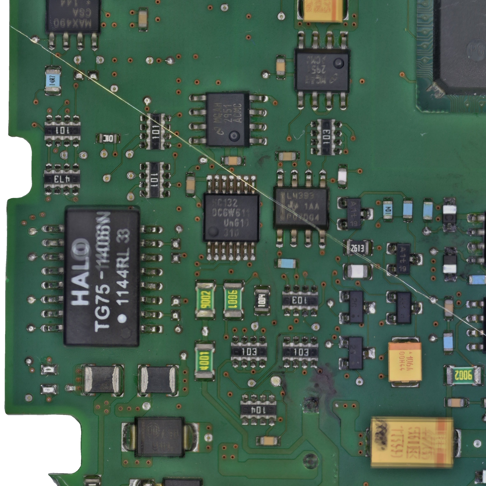
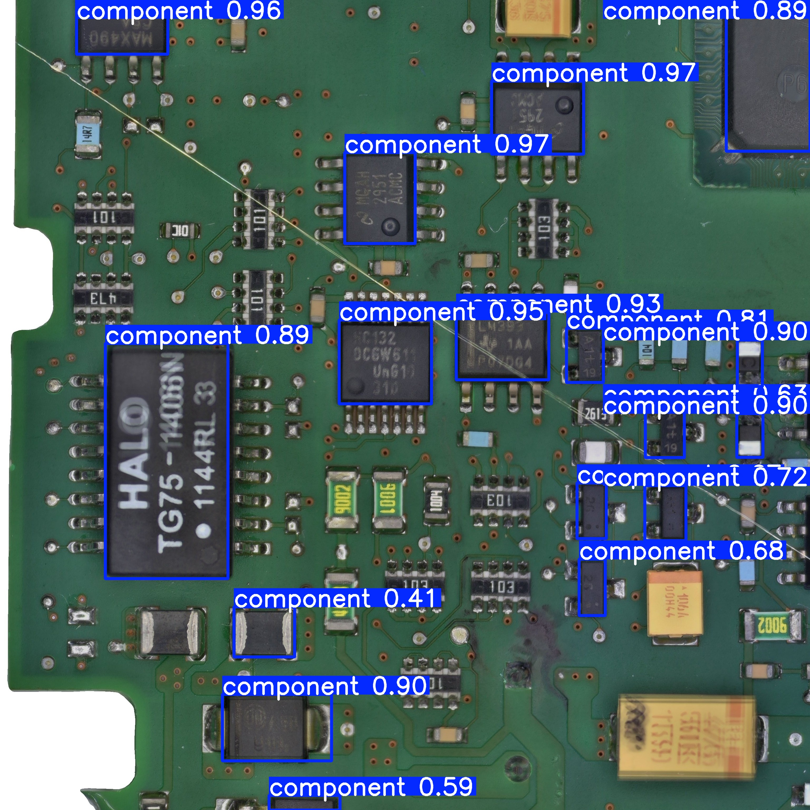

# PCB AI Doctor

低成本自動化 PCB 電路板分析系統 — 利用 3D printer + USB 顯微鏡 + AI，自動掃描、偵測、識別 PCB 上的電子元件。

## Demo

| Input (3072x3072 chunk) | YOLO Detection Result |
|:---:|:---:|
|  |  |

> YOLOv12n 偵測結果：17 個元件，confidence 0.41~0.97（測試圖片不在訓練集中）

## Pipeline

```
掃描 → 拼接 → 去背 → 偵測 → 識別 → Pinout
```

1. **掃描** — 3D printer 搭載 USB 顯微鏡，自動逐格掃描 PCB 板
2. **拼接** — 全板影像拼接，產生高解析度完整 PCB 圖
3. **去背** — RMBG 移除背景雜訊
4. **偵測** — YOLO 自動定位所有電子元件
5. **識別** — AI 辨識元件型號與規格
6. **Pinout** — 自動生成引腳定義 SVG overlay

## Models

| Model | Architecture | Classes | Weights |
|-------|-------------|---------|---------|
| YOLOv8n | Ultralytics YOLOv8 nano | 1 (component) | `yolo-training/weights/best_v8n.pt` |
| YOLOv12n | Ultralytics YOLOv12 nano | 1 (component) | `yolo-training/weights/best_v12n.pt` |

## Project Structure

```
├── lib/                  # 核心控制 library（printer、camera、scan）
├── yolo-training/        # YOLO 訓練 pipeline
│   ├── weights/          # 訓練好的模型權重
│   ├── reports/          # 訓練報告（confusion matrix、PR curve）
│   └── scripts/          # 資料集準備腳本
├── THIRD-PARTY-LICENSES.md
└── LICENSE               # CC BY-NC 4.0
```

## Hugging Face

模型權重與訓練報告：[chunchun9999/pcb-ai-doctor](https://huggingface.co/chunchun9999/pcb-ai-doctor)

## License

CC BY-NC 4.0 — 非商業用途
